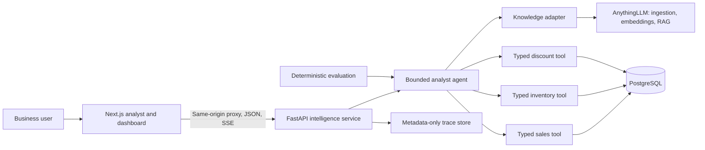

# InsightHub

InsightHub is a professional knowledge and data analyst for teams whose answers are split across company documents and operational data. It combines retrieval-backed policy evidence, read-only business metrics, citations, evaluation, and a traceable web experience in one deployable system.

The included Nova Retail Distribution dataset demonstrates the central business problem: answer a question that requires both a policy document and transactional evidence, without asking a user to reconcile separate systems by hand.

## The Showcase

> What is the maximum VIP discount, how much Q3 VIP revenue did we generate, and how many orders violated the policy?

InsightHub retrieves the 12% policy cap from the knowledge base, gets Q3 VIP revenue of $3,137,371.50 from PostgreSQL-backed business tools, and identifies 180 discount events above the cap, including 120 unapproved violations. The answer includes policy citations and a sanitized trace of the tools used.

See the full [Nova Retail demo script](demo/demo-script.md).

## Solution Architecture



AnythingLLM is used as an external OSS RAG component, not forked. InsightHub owns the FastAPI intelligence boundary, agent orchestration, typed data tools, read-only safety controls, evaluation, trace metadata, and product UI. Read the [architecture overview](docs/architecture/overview.md) for component details.

## Technical Highlights

- One bounded tool-calling orchestrator with explicit typed contracts instead of a distributed multi-agent system.
- RAG-backed answers and citations for policies and business documents via AnythingLLM.
- Typed PostgreSQL business tools with read-only access boundaries, validation, and no browser-provided SQL.
- Server Sent Events for progressive answer rendering while preserving the existing JSON API.
- Metadata-only traces showing run status, selected tools, and durations without prompts, document content, credentials, or database rows.
- Focused executive dashboard with lightweight CSS charts and no heavy BI dependency.
- Docker Compose topology designed for a modest single-host deployment.

## Evaluation Results

The tracked deterministic evaluation report records **24/24 passing cases** and a **1.00 overall score**. It validates tool selection, facts, citations, required historical context, hallucination guards, abstention, clarification, and failure recovery. It does not depend on an LLM judge.

The report is reproducible from the repository root:

```bash
python evaluation/agent/runner.py
```

See [agent evaluation documentation](docs/testing/agent-evaluation.md) and the tracked [latest report](evaluation/agent/reports/latest.json).

## Screenshots

Real demo captures are intentionally not fabricated or checked in. Capture guidance is reserved for:

- [Analyst chat](docs/screenshots/chat.md)
- [Executive dashboard](docs/screenshots/dashboard.md)
- [Execution trace](docs/screenshots/trace.md)

## Local Demo

Requires Python 3.12, Node.js 22, and Docker.

```bash
cp .env.example .env
docker compose --env-file .env -f deployment/docker-compose.yml up --build
```

Configure `LLM_BASE_URL`, `LLM_API_KEY`, `LLM_MODEL`, and `ANYTHINGLLM_API_KEY` in the uncommitted `.env`, then make sure the Nova Retail documents are indexed in the configured AnythingLLM workspace.

Open:

- Analyst: `http://localhost:3000`
- Executive dashboard: `http://localhost:3000/dashboard`
- API health: `http://localhost:8000/health/live`
- AnythingLLM: `http://localhost:3001`

Start with the questions in [the demo script](demo/demo-script.md), especially the mixed policy and compliance question.

## API Surface

| Method | Endpoint | Purpose |
| --- | --- | --- |
| `POST` | `/api/v1/agent/query` | JSON agent response |
| `POST` | `/api/v1/agent/query/stream` | SSE answer delivery |
| `GET` | `/api/v1/agent/runs/{run_id}` | Metadata-only execution trace |
| `GET` | `/api/v1/overview` | Curated executive intelligence overview |
| `GET` | `/api/v1/investigations/{id}` | Curated signal investigation workspace |
| `GET` | `/api/v1/data/sales/summary` | Sales summary |
| `GET` | `/api/v1/data/inventory/risk` | Aging inventory |
| `GET` | `/api/v1/data/discount/violations` | Discount controls |

## Validation

Backend, from `services/intelligence`:

```bash
pytest
ruff check .
mypy app
```

Frontend, from `apps/web`:

```bash
npm install
npm run lint
npm run build
```

Docker Compose:

```bash
docker compose --env-file .env -f deployment/docker-compose.yml config
```

See [production deployment](docs/deployment/production.md), the [case study](docs/case-study.md), and the [freelance customization brief](docs/freelance-pitch.md) for deployment, engineering tradeoffs, and engagement options.
