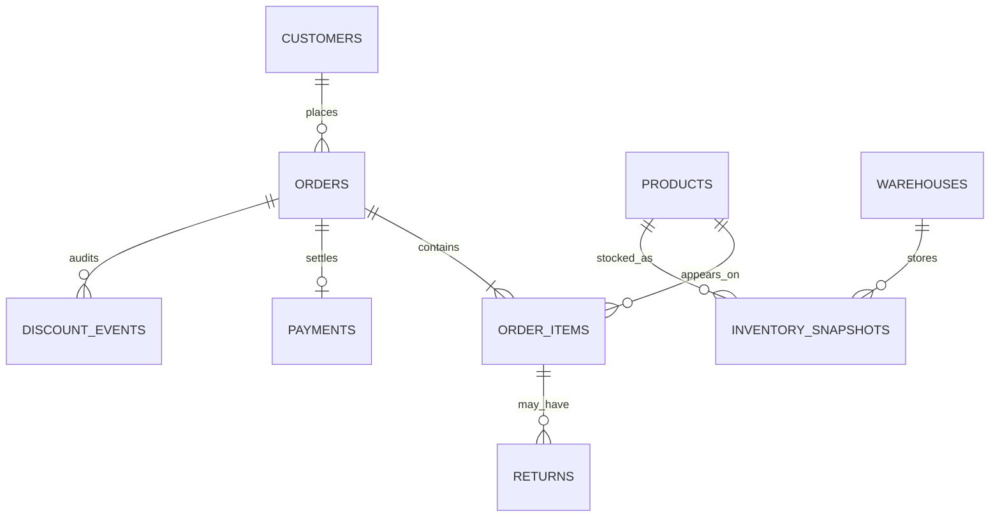

# Nova Retail Data Model

## Business Scenario

Nova Retail is a fictional e-commerce retailer with sales, customer segmentation, product catalog, fulfillment inventory, payments, returns, and discount governance. The dataset covers Q2 and Q3 2025 sales and dated inventory snapshots through 2025-10-31. Product Luna retains its documented $300,000 Q2 revenue, $246,000 Q3 revenue, and 12,000-unit / 138-day inventory fact as of 2025-09-30.

## Entities and Relationships

| Entity | Purpose | Relationships |
| --- | --- | --- |
| `customers` | Customer identity, segment, and region | One customer has many orders |
| `products` | Catalog item, price, and unit cost | One product has many order items and inventory positions |
| `orders` | Order header with customer, region, channel, and compatibility fields | One customer has many orders; one order has many items |
| `order_items` | Authoritative sales line item with quantity, price, discount, and cost basis | References one order and one product |
| `returns` | Partial or full line-item returns with refund and reason | References the exact order/item pair |
| `payments` | Settlement state for an order | One-to-one with orders |
| `warehouses` | Small fulfillment-location dimension | One warehouse has many inventory snapshots |
| `inventory_snapshots` | Dated on-hand, reserved, available, and received-date positions | References one product and one warehouse |
| `inventory` | Latest aggregate compatibility projection | References one product; not used for historical analysis |
| `discount_events` | Discount requests and approval audit | References one order |

## Metric Definitions

- **Gross revenue**: sum of `order_items.quantity * order_items.unit_price`, before item discounts and refunds.
- **Post-discount revenue**: gross revenue less `order_items.discount_amount`.
- **Net revenue after refunds**: post-discount revenue less `returns.refund_amount`.
- **Units sold**: sum of ordered line-item quantity before returns.
- **Order count**: distinct order headers represented by the selected line items.
- **Average order value**: gross revenue divided by distinct order count for the selected grouping.
- **Return rate**: returned units divided by ordered units for the selected **order-date** period and filters. The typed returns summary deliberately measures the return experience of a sales cohort, rather than return processing volume by return date.
- **Gross margin after refunds**: post-discount revenue less refunds and item cost basis. It intentionally does not model restocking or return-shipping cost reversals.

## Temporal Inventory

`inventory_snapshots` is the source for all historical and warehouse analysis. Each row is a product/warehouse/date position with on-hand and reserved quantities; available inventory is deterministically `on_hand_quantity - reserved_quantity`. The retained `inventory` table is a latest aggregate compatibility projection for the existing inventory-risk API, so it cannot be used to answer an as-of question.

## Access Patterns and Indexes

- `orders(customer_id, order_date)` supports customer-period history; `orders(product_id, order_date)` preserves the existing product-quarter summary path.
- `orders(region, sales_channel, order_date)` supports bounded dimensional sales filters without indexing every order attribute.
- `order_items(order_id)` and `order_items(product_id)` support the two primary line-item joins: order headers and product performance.
- `returns(order_item_id, return_date)` supports return lineage and time-window analysis.
- `inventory_snapshots(product_id, snapshot_date)` and `inventory_snapshots(warehouse_id, snapshot_date)` support product-as-of and warehouse-as-of inventory queries.

These indexes align with the exposed typed service filters. No general-purpose index is added for arbitrary SQL because this phase intentionally does not provide arbitrary SQL execution.

## Why Each Source Exists

The PostgreSQL tables represent operational data that should be accessed through typed, bounded services: revenue, returns, margins, customer segments, channel performance, and dated inventory all depend on controlled joins and aggregation. Raw NL2SQL would expose unnecessary schema breadth and make metric definitions harder to keep deterministic. The Markdown documents represent policy and narrative knowledge: the 12% VIP discount limit, the 90-day inventory review rule, and the Q3 business interpretation. Keeping these sources separate creates a realistic foundation for future cross-source reasoning without changing the agent in this phase.

The deterministic seed creates 5,000 customers, 120 products, 50,000 orders, 64,837 order items, 6,604 returns, 50,000 payments, three warehouses, 1,080 dated inventory snapshots, 120 compatibility inventory records, and 1,500 discount events. See [Golden Facts](../../demo/nova-retail/GOLDEN_FACTS.md) for exact validated totals.
