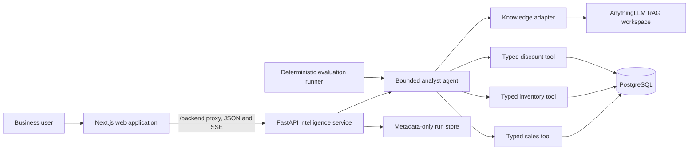

# Architecture Overview

InsightHub is a small, single-host knowledge and data analyst. Its architecture separates commodity RAG infrastructure from the custom intelligence, data-access, evaluation, and product layers.

## Frontend

`apps/web` is a Next.js App Router application with an analyst chat and an executive dashboard. Browser traffic goes through a same-origin `/backend` rewrite, so provider credentials and database credentials never enter browser code. The analyst consumes JSON and Server Sent Events; it renders Markdown, citations, and a metadata-only trace timeline. The dashboard uses existing typed data endpoints and lightweight CSS charts.

## API

`services/intelligence` is a FastAPI service that owns application-facing contracts, validation, logging, health checks, and orchestration. The existing JSON agent endpoint remains available alongside an SSE endpoint for progressive answer delivery. Each completed agent run receives a bounded, process-local metadata record containing only status, tool names, and durations.

## Agent

The analyst is one bounded orchestrator with explicit tools. It selects the smallest sufficient set of tools for a question instead of running every integration. Iteration, timeout, and failure limits make behavior easier to inspect and evaluate than a distributed multi-agent design.

## RAG

AnythingLLM remains the OSS boundary for document ingestion, chunking, embeddings, vector search, and source citations. The FastAPI knowledge adapter calls its API rather than modifying its internals. Documents remain distinct from structured data until the agent synthesizes a response.

## Database and Data Tools

PostgreSQL contains the Nova Retail transactional dataset. The agent uses typed sales, inventory, and discount services, not browser-provided SQL. Application services validate business inputs and repositories own database queries. Database access is read-only, bounded, and isolated from the frontend. DuckDB remains the intended engine for CSV and spreadsheet analytics, separate from RAG.

## Evaluation

The deterministic agent evaluation suite is defined in `evaluation/agent/questions.json` and run with `python evaluation/agent/runner.py`. It checks tool selection, facts, sources, required context, hallucination guards, abstention, clarification, and failure recovery without relying on an LLM judge. The tracked report in `evaluation/agent/reports/latest.json` records the latest reproducible result.
